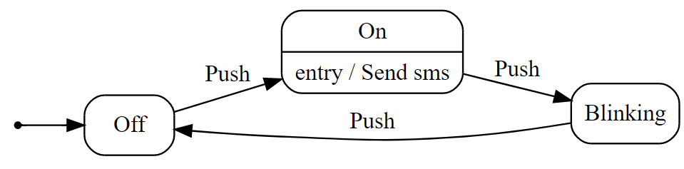

# Maszyna stanu w praktyce

Kod źródłowy pochodzący z mojego wystąpienia na konferencji [**4Developers**](https://4developers.org.pl/lecture_warszawa_2020/#id=62335)

## Wstęp
Maszyna stanów może wydawać się nudną, matematyczną koncepcją, o której zwykle zapominamy wraz z zaliczonym egzaminem na studiach. Okazuje się jednak, że dzięki niej można uprościć wiele problemów spotykanych w biznesowych projektach. Pokażę Wam jak użyć maszyny stanów w aplikacji .NET Core i udoskonalić nasze projekty.

## Wymagania
- .NET Core 3.1

## Instalacja biblioteki

~~~ bash
dotnet add package Stateless --version 5.1.3
~~~

## Definicja maszyny stanów
Określamy typ stanu (State), typ wyzwalacza (Trigger) oraz stan początkowy (Init State).

~~~ csharp
StateMachine<LampState, LampTrigger> machine = new StateMachine<LampState, LampTrigger>(LampState.Off);
~~~

## Konfiguracja przejść
Za pomocą metody _Configure()_ oraz _Permit()_ definiujemy dopuszczalne przejścia. Dodatkowo za pomocą metod _OnEntry()_ i _OnExit()_ możemy zdefiniować dodatkowe akcje, które mają być uruchamianie przy wejściu lub po wyjściu ze stanu.

~~~ csharp
machine = new StateMachine<LampState, LampTrigger>(LampState.Off);

machine.Configure(LampState.Off)
    .Permit(LampTrigger.Push, LampState.On);

machine.Configure(LampState.On)
    .Permit(LampTrigger.Push, LampState.Blinking)
    .OnEntry(() => Console.WriteLine("Send sms"), "Send sms");

machine.Configure(LampState.Blinking)
    .Permit(LampTrigger.Push, LampState.Off);
~~~

## Uruchomienie wyzwalacza
Na podstawie wcześniej zdefiniowanej konfiguracji nastąpi przejście do kolejnego stanu.
Jeśli przejście nie zostało zdefiniowane pojawi się Exception.

~~~ csharp
machine.Fire(LampTrigger.Push);
~~~

## Pobranie bieżącego stanu
~~~ csharp
Console.WriteLine(machine.State)
~~~ 

## Sprawdzenie wyzwalacza
~~~ csharp
machine.CanFire(LampTrigger.Push)
~~~

## Śledzenie maszyny stanów   
~~~ csharp
 machine.OnTransitioned(t=> Console.WriteLine($"{t.Source} -> {t.Destination}"));
~~~        
            
## Wygenerowanie grafu
~~~ csharp
Console.WriteLine(Stateless.Graph.UmlDotGraph.Format(machine.GetInfo()));
~~~

Zostanie wygenerowany graf w formacie [ DOT Graph](https://en.wikipedia.org/wiki/DOT_(graph_description_language)), 

~~~
digraph {
compound=true;
node [shape=Mrecord]
rankdir="LR"
Off [label="Off"];
On [label="On|entry / Send sms"];
Blinking [label="Blinking"];

Off -> On [style="solid", label="Push"];
On -> Blinking [style="solid", label="Push"];
Blinking -> Off [style="solid", label="Push"];
 init [label="", shape=point];
 init -> Off[style = "solid"]
}
~~~

## Wizualizacja grafu
Diagram można wyświetlić na stronie:
http://www.webgraphviz.com

## Biblioteka Arduino
**Automaton**
https://www.arduinolibraries.info/libraries/automaton
